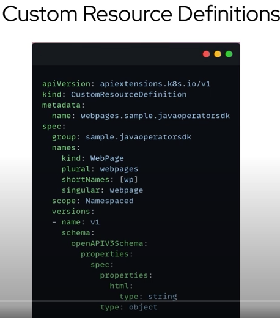
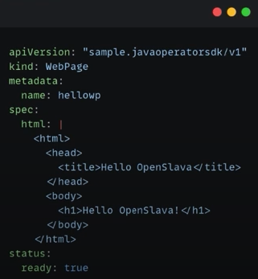
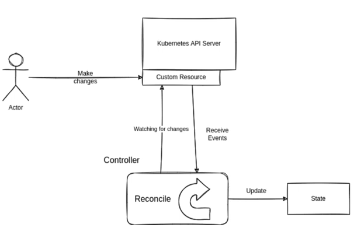
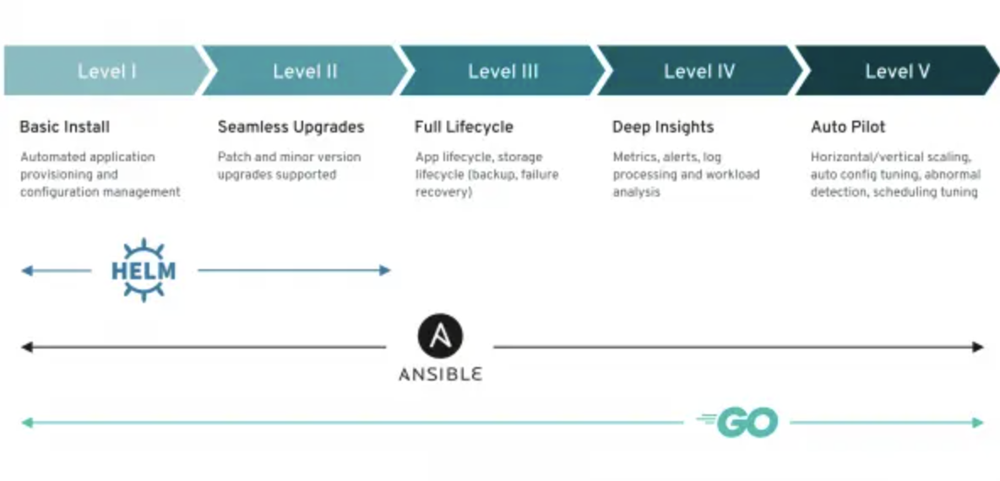
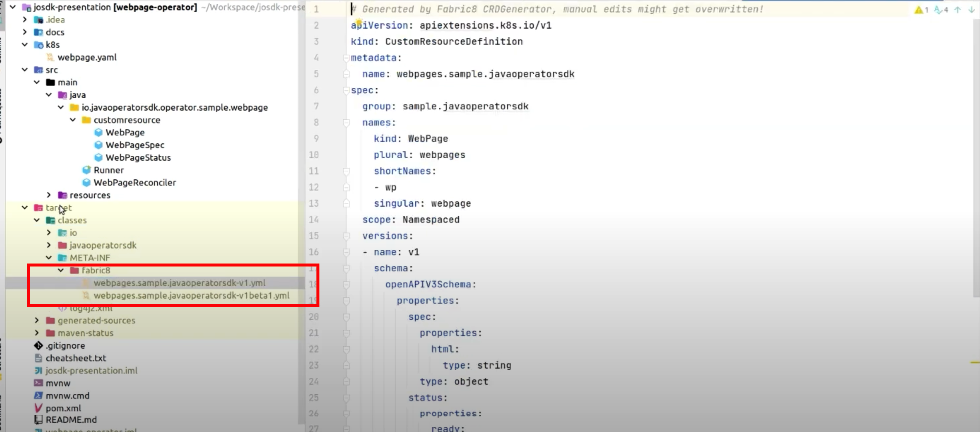
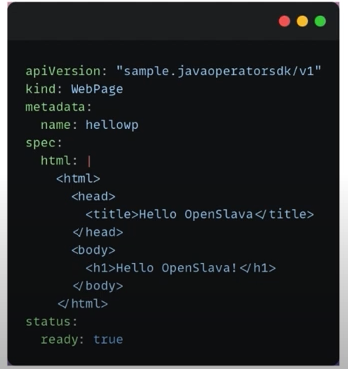

### Conf

* Source: https://www.youtube.com/watch?v=CvftaV-xrB4
* Training resource: https://developers.redhat.com/articles/2023/08/16/how-implement-kubernetes-operators-java-operator-sdk#
* Most important operator: keycloak in java https://github.com/keycloak/keycloak/tree/main/operator

### Intro

- Kubernetes provides resource types as pods, deployments, configmaps...
- Custom resources is another kind of resource that user can implement
- We basically need to implement a custom resource definition
    - With a new type as kind
    - It provides an schema
    - If we make Kubernetes apply it will extend it



- If we apply the following webpage



It will react as a new webpage as an static resource
Kubernetes will have a custom resource that will stay in the server as it is.

It contains a page status too

The problem will be serving it, but is an example of custom resource


## What are Kubernetes operators

- An operator is an extension that will provide how to use the custom resource in the application.
- It will describe a custom resource an will try to "reconcile" it with the system.
- The controller is the responsible of tracking at least one resource type. These objects have a spec field that represents the desired state. Controller is the responsible of making that a current state gets closer to a desired state.



- A controller is a pod that reconciles the desired state with the actual state.
- K8s support ends with the API serer

### Operator frameworks

- Go is the most famous (k8s is implemented in go)
- In java we have the JavaOperatorSdk with the Fabric client as helpful generator.
- Java operator Sdk or JOSDK is accessible from any framework
- The JOSDK has community support for Quarkus & Spring as extensions
  It's a framework offered as a quarkus extension too
  Also exists a spring boot starter
- If the service is generally implemented in java, the operator can follow the same language.

JDK version Info

- JOSDK - Java operators sdk supports JDK11
- Quarkus adapter recommends JDK21. Minimum is JDK17

### How to start

Install the operator SDK, which can be done via brew too

https://sdk.operatorframework.io/docs/installation/#install-from-github-release
https://formulae.brew.sh/formula/operator-sdk
https://sdk.operatorframework.io/docs/cli/operator-sdk/

```bash
brew install operator-sdk
```

The Operator SDK is a set of open source tools for building, testing, and packaging operators. You can use the SDK CLI to scaffold a project, and it also provides prebuilt commands to generate code. The SDK uses Make, a build automation tool that runs commands configured in a makefile to generate executable code and libraries from source code.

The SDK also lets you install the Operator Lifecycle Manager (OLM) using the command line. The OLM is a set of cluster resources that manage an operator's life cycle. Once installed, you can see the status of the OLM to verify whether the SDK can successfully communicate with the OLM components in the cluster.

##### Option 1: operator-sdk CLI (deprecated)

Deprecated for quarkus. We can't generate a project with the following
https://access.redhat.com/articles/6955985

Official tech stack is Helm, Go and Ansible



```bash
#Create an empty directory named echo-operator. Then cd into it and run
# Check the current system plugins
operator-sdk --plugins
                                   Plugin keys | Supported project versions
-----------------------------------------------+----------------------------
           ansible.sdk.operatorframework.io/v1 |                          3
              declarative.go.kubebuilder.io/v1 |                       2, 3
       deploy-image.go.kubebuilder.io/v1-alpha |                          3
                          go.kubebuilder.io/v2 |                       2, 3
                          go.kubebuilder.io/v3 |                          3
                          go.kubebuilder.io/v4 |                          3
               grafana.kubebuilder.io/v1-alpha |                          3
              helm.sdk.operatorframework.io/v1 |                          3
 hybrid.helm.sdk.operatorframework.io/v1-alpha |                          3
            quarkus.javaoperatorsdk.io/v1-beta |                          3
#operator-sdk init --plugins quarkus --domain example.com --project-name echo-operator
#operator-sdk init --plugins quarkus.javaoperatorsdk.io/v1-beta --domain example.com --project-name echo-operator

#Next, we'll follow up with scaffolding our API and open the IDE:
#operator-sdk create api --group example --version v1 --kind EchoResource
```

##### Option 2: mvn archetype

Create a project:

Check last project version at https://mvnrepository.com/artifact/io.javaoperatorsdk/java-operator-sdk
https://javaoperatorsdk.io/docs/getting-started/


This approach uses a basic javaoperatorsdk implementation
Is not quarkus implemented and it means raw java version

> At time of writing there were issues while building it
If you start the application it will trigger the following when starting it

```
 io.javaoperatorsdk.operator.OperatorException: Couldn't start source ControllerResourceEventSource
```
You will need to go to the section FIX forbidden access


How to generate the code:

```bash
#Example:
# mvn io.javaoperatorsdk:bootstrapper:[version]:create -DprojectGroupId=org.acme -DprojectArtifactId=getting-started
#Requires JDk21
sdk default java 21.0.4-graal
#It will generate the projectArtifactId folder too! In this case "getting-started"
mvn io.javaoperatorsdk:bootstrapper:4.9.2:create -DprojectGroupId=org.acme -DprojectArtifactId=getting-started
```

##### Option 3: quarkus CLI

> It's the default setup by paas
> It does not need an startup class
> Recommended approach as the boilerplate works 100%. It includes dockerization and also comes without any base code.

https://quarkus.io/guides/cli-tooling
https://quarkus.io/extensions/io.quarkiverse.operatorsdk/quarkus-operator-sdk/
https://docs.quarkiverse.io/quarkus-operator-sdk/dev/index.html


Another option is to execute the following, although this template is more basic than using the archetype that provides an example.

```bash
$ brew install quarkusio/tap/quarkus
$ quarkus --version
3.13.0
# Then we add the extension for the operator
# quarkus ext add io.quarkiverse.operatorsdk:quarkus-operator-sdk
quarkus create app org.acme:qosdk-test -x='qosdk'
cd qosdk-test
#If you also want to use the OLM bundle generation extension, you can add the olm extension to the extension list as in:
quarkus create app info.magnolia:qosdk-test-olm -x='qosdk,olm'
```

https://github.com/quarkiverse/quarkus-operator-sdk?tab=readme-ov-file#interactive-operator-development

To develop interactively the connector:
The easiest way to iterate faster on developing your operator is to use the Quarkus Dev Mode to write your operator as it's running.

Start the dev mode (quarkus dev or mvn quarkus:dev). Once the QOSDK extension is installed for a project, you get access to dev mode commands provided by QOSDK to help you in moving faster. In the dev mode console, press : (column), you'll get a terminal prompt. If you then press tab, you'll see a list of available commands, among which should be one named qosdk, which, in turn, provides several sub-commands (versions and api at this time).

You can type qosdk api --help or qosdk versions --help to get more information about these commands.

The qosdk api command helps you quickly add a custom resource (an API in Kubernetes parlance) along with associated spec, status and reconciler classes while your operator is running.

```
Usage: qosdk api [<options>]
Creates a Kubernetes API represented by a CustomResource and associated reconciler
Options:
  -k, --kind     Your API's kind, used to generate a CustomResource class with associated spec, status and Reconciler classes
  -g, --group    Your API's group, e.g. halkyon.io, this will also be used, reversed, as package name for the generated classes
  -v, --version  Your API's version, e.g. v1beta1
  -h, --help
```


You can alternatively use https://code.quarkus.io/
https://opensource.com/article/21/4/quarkus-tutorial


#### Key aspects

There are 3 very important dependencies:
- the java operator framework <artifactId>operator-framework</artifactId>
  This is the api part for kubernetes
- the fabric crd plugin  <artifactId>crd-generator-apt</artifactId>
  It will generate all the resource definitions that are needed under META-INF folder on packaging
  target/classes/META-INF/fabric8



### How to prepare a kubernetes environment locally

Docker desktop comes with a local environment that can be enabled
Using minikube should be straight away

https://octopus.com/blog/testing-kubernetes-locally
https://minikube.sigs.k8s.io/docs/start/?arch=%2Fmacos%2Farm64%2Fstable%2Fbinary+download

To activate the one under docker desktop, proceed with the preferences tab and select your contexts with the following commands (link: https://docs.docker.com/desktop/kubernetes/):

```bash
kubectl config get-contexts
kubectl config use-context docker-desktop
```

You can then keep working with the kubectl commands as usual


### Basic example

https://javaoperatorsdk.io/docs/using-samples/

We will have a controller that will manage the following resources:
- a config map with the html on it
- deployment with nginx with the config map mounted as the static resource
- a service exposing the pod



#### How to start

> mvn clean install

The crd generator will write all the yaml files for resources in kubernetes
We have a reconciler which is going to be the one exposing the values and transform in the cycle loop for the definitions

Alternative:

> quarkus dev \\ mvn quarkus:dev

You can see the generated files under target/classes/META-INF/fabric8


#### Startup class: Runner

We just mention to use the Kubernetes client and in this case we register the reconciler

```java
public class Runner {
    private static final Logger log = LoggerFactory.getLogger(Runner.class);
    public static void main(String[] args) {
        KubernetesClient client = new KubernetesClientBuilder().build();
        Operator operator = new Operator();
        operator.register(new WebPageReconciler(client));
        operator.start();
        log.info("Operator started.");
    }
}
```

#### Reconciler class: WebpageReconciler

Implementing the Control Loop happens in the Reconciler logic
At this point, we are ready to implement the control loop.
We mention here to do not happen anything there

```java
@ControllerConfiguration
public class WebPageReconciler implements Reconciler<WebPage> {    
    private KubernetesClient client;
    public WebPageReconciler(KubernetesClient client){
        this.client = client;
    }
    @Override
    public UpdateControl<WebPage> reconcile(WebPage arg0, Context<WebPage> arg1) throws Exception {
        return UpdateControl.noUpdate();
    }
}
```

The reconciller is going to let K8s when to update or trigger the different services, and we can program how
the configmaps, services and deployments are managed.

It will also generate the refresh needs for the control loop
Code is evolved, but this snippet is the minimal need you will use.

The controller in an operator is customized for one particular stateful workload. Each stateful workload has its own operator with its own controller that knows how to manage that workload.

#### Resource class: Webpage + WebPageSpec + WebPageStatus

This are basically mappers for the configurations, that allow us to read properly and define the basic values of the yml files

The WebPage class is a custom resource definition (CRD) in a Java Operator SDK project. It is used to define a custom resource that can be managed by the operator. Is a custom resource definition that allows you to define and manage web pages in a Kubernetes cluster using a Java Operator SDK project. The WebPageSpec class represents the desired state of the web page, and the WebPageStatus class represents its current state.

In Kubernetes, controllers in the control plane run in a control loop that repeatedly compares the cluster's desired state to its current state. If the states don’t match, then the controller takes action to adjust the current state to more closely match the desired state.

Similarly, the controller in an operator watches a specific CR type and takes application-specific actions to make the workload’s current state match the desired state as expressed in the CR.

```java
@Group("sample.javaoperatorsdk")
@Version("v1")
@ShortNames("wp")
public class WebPage extends CustomResource<WebPageSpec, WebPageStatus> implements Namespaced {
    
}

public class WebPageSpec {
    private String html;

    public String getHtml() { return html;}

    public WebPageSpec setHtml(String html){
        this.html = html;
        return this;
    }
}
public class WebPageStatus {
    private Boolean ready;

    public Boolean getReady(){ return ready;}

    public WebPageStatus setReady(Boolean ready){
        this.ready = ready;
        return this;
    }
}
```

From here: https://blog.container-solutions.com/cloud-native-java-infrastructure-automation-with-kubernetes-operators


#### Deploying the Operator

There are different ways to deploy the operator, either for dev or production usage.

One thing to be considered is that the project will fail if not CRD are defined.

```bash
kubectl get crds
```

In this case you need to apply the crd to be listed there.


For development:
- The easier way to deploy is to make a mvn clean install and place a kubectl apply -f on the generated file in meta inf
- The next step is to make the aplication start.
- Once the aplication has started it will look out for changes in the descriptor

In our case we are going to deploy the webpage.yaml, which will force the update status in the nginx service.
In this case we need a basic boilerplate folder which usually by convention is k8s folder

Under k8s folder generate a k8s/webpage.yaml file

```yaml
apiVersion: "sample.javaoperatorsdk/v1"
kind: WebPage
metadata:
  name: hellowp
spec:
  html: |
    <html>
      <head>
        <title>Hello world</title>
      </head>
      <body>
        <h1>Hello world!!!!!</h1>
      </body>
    </html>
```

It will detect the file as the apiVersion in the customResource will fit the new one.
In this case only html will placed in the bean

After changin the file it will reallocate each second the new configuration

```java
@Group("sample.javaoperatorsdk")
@Version("v1")
@ShortNames("wp")
```


For production:

deployment there is a dockerizarization way, which can be triggered by the following steps:
To build and deploy our Operator to Kubernetes we need to take the following steps:
Configure docker-registry property in ~/.m2/settings.xml

```bash
#Build Docker image and push it to the remote registry:
mvn package dockerfile:build dockerfile:push
#Create CustomResourceDefinition on the cluster: 
kubectl apply -f crd.yaml
#Create RBAC objects:
kubectl apply -f rbac.yaml
#Deploy the operator: 
kubectl apply -f operator-deployment.yaml
```


### TBD -  Building the Docker Image

Depending on the builder archetype you use (maven/quarkus) the infra for the dockerfile will be already generated.
If not created, you can proceed similar to this

The SDK currently doesn’t help with building a Docker image out of your code, but the sample contains a fully functional build using the dockerfile-maven-plugin. You will have to define the docker-registry property either in your settings.xml. I used eu.gcr.io for pushing to the Google Cloud Container Registry.

```xml
<plugin>
   <groupId>com.spotify</groupId>
   <artifactId>dockerfile-maven-plugin</artifactId>
   <version>1.4.12</version>
   <configuration>
       <repository>${docker-registry}/mysql-schema-operator</repository>
       <tag>${project.version}</tag>
       <buildArgs>
           <JAR_FILE>${project.build.finalName}.jar</JAR_FILE>
       </buildArgs>
   </configuration>
</plugin>
```

The plugin needs an actual Dockerfile (and Docker installed), which it will use to execute the Docker build. It will provide the JAR_FILE argument to Docker.

```bash
FROM openjdk:12-alpine
ENTRYPOINT ["java", "-jar", "/usr/share/operator/operator.jar"]
ARG JAR_FILE
ADD target/${JAR_FILE} /usr/share/operator/operator.jar
```

This build also assumes that the artifact produced by maven package is an executable jar file. In the example pom file I use the shader plugin, but you can also use Spring Boot or a number of other methods to do this.


### Installing Rabbit MQ operator

```
kubectl apply -f https://github.com/rabbitmq/cluster-operator/releases/latest/download/cluster-operator.yml
```

Once installed the cluster is deployed. It will generated also it's custom CRd which can be read from the following

```bash
$> kubectl get crd
NAME                                         CREATED AT
mgnlmessagebrokers.magnolia.info             2024-08-02T11:28:43Z
rabbitmqclusters.rabbitmq.com                2024-08-02T11:46:39Z
webpages.info.magnolia.k8s.javaoperatorsdk   2024-08-02T10:03:00Z
$> kubectl describe crd rabbitmqclusters.rabbitmq.com > definition.yaml
```


More info at: https://www.youtube.com/watch?v=GxdyQSUEj5U

### Permissions to Access the Kubernetes API

src: https://blog.container-solutions.com/cloud-native-java-infrastructure-automation-with-kubernetes-operators


Most applications running on Kubernetes don’t need access to the Kubernetes API. 
However, operators— by definition— do, because they work with resources defined and updated in the API. 
It is unavoidable to deal with the Kubernetes RBAC (Role Based Access Control) mechanism.

The ClusterRole resource defines a group of permissions. 
It gives access to do all operations on MySQLSchema resources as well as listing and getting CustomResourceDefinitions. 
The Operator will of course need to watch all schema resources on the cluster as well as update them when the status changes. 
As for the CustomResourceDefinitions, the operator needs to get it’s own CRD on startup to get some metadata. This might not be necessary in a future release of the SDK.

### Deploy the operator

Our operator will be deployed as a normal deployment on Kubernetes. This will ensure there is always a single instance of the operator running. The ’Recreate’ upgrade strategy will make sure that the old version gets shut down first before a new version starts up during an upgrade.


In this layer we are going to use a Quarkus project, which contains a much better implementation.
The quarkus implementation does not contain a main class, so all the project works as a focus point.

Remember, as before, we generate the new project with the create app
Read https://docs.quarkiverse.io/quarkus-operator-sdk/dev/index.html for details.

Let's make a summary of the steps first, and then explain:

The detailed explanation is on the previous info project, but in a nutshell, to generate a operator and deploy in a cluster we need to:

- Install locally the quarkus CLI to generate the project
- Setup the project with some basics. Quarkus project does not have main class if we use the generator

```bash
$> quarkus create app info.magnolia:qosdk-test-olm -x='qosdk,olm'
$> cd qosdk-test-olm
$> quarkus dev / mvn quarkus:dev
# press : (column) > qosdk api --help (or just help to see all quarkus dev commands)
$> : > quarkus-console $>  qosdk api -k customKind -g info.magnolia.k8s -v v1
Generated src/main/java/k8s/magnolia/info/CustomKindSpec.java
Generated src/main/java/k8s/magnolia/info/CustomKindReconciler.java
Generated src/main/java/k8s/magnolia/info/CustomKindStatus.java
Generated src/main/java/k8s/magnolia/info/CustomKind.java
```

- Compile. On compilation we need to bring container repository connection, via properties, JVM args or ENV properties

```bash
$> mvn clean package -Pnative,container 
-Dquarkus.container-image.registry=localhost:5001 
-Dquarkus.container-image.group='' 
-Dquarkus.container-image.name='quarkus-test-operator' 
-Dquarkus.container-image.tag=latest 
-Dquarkus.kubernetes.namespace='ns-example'
```

- Build artifacts

```bash
$> docker build -t quarkus-test-operator -f ./src/main/docker/Dockerfile.native .
$> docker images --filter "reference=quarkus-test-operator"
# docker run -d -p 5001:5000 --name registry registry:latest
# docker tag quarkus-test-operator:latest localhost:5001/quarkus-test-operator:latest
# docker push localhost:5001/quarkus-test-operator:latest
$> docker push <your-registry-url>/<your-image-name>:latest
```

- Deploy

  > It’s recommended a specific namespace as otherwise it collides with perms on default settings of kubernetes. You need to specify the namespace on compilation time.
  
    - To create a namespace and perms properly, from the previous example do:

    ```bash
    kubectl create namespace ns-example
    ```

    - Create clusterole

        ```yaml
        apiVersion: rbac.authorization.k8s.io/v1
        kind: ClusterRole
        metadata:
          name: qosdk-test
        rules:
          - apiGroups:
              - info.magnolia.k8s
            resources:
              - customkinds
            verbs:
              - get
              - list
              - watch
        ```

    - Create binding for the cluster role

    ```yaml
    apiVersion: rbac.authorization.k8s.io/v1
    kind: ClusterRoleBinding
    metadata:
      name: qosdk-test-binding
    subjects:
      - kind: ServiceAccount
        name: qosdk-test
        namespace: ns-example
    roleRef:
      kind: ClusterRole
      name: qosdk-test
      apiGroup: rbac.authorization.k8s.io
    ```

    - Apply them

    ```bash
    kubectl apply -f qosdk-test-clusterrole.yaml
    kubectl apply -f qosdk-test-clusterrolebinding.yaml
    ```

    - To deploy, after this details it should be straight away. The deployment will create all the k8s resources automatically.

  > You need access to the target folder of the compiled resources. Consider for CICD adding them as an artifact for /target/kubernetes folder
>

```bash

## Let's generate the CRD definitions and install them in the cluster
$> kubectl apply -f target/kubernetes/customkinds.info.magnolia.k8s-v1.yml
## This is the deployment for the infrastructure of the operator in the cluster. 
$> kubectl apply -f target/kubernetes/kubernetes.yml

```

All at once recipe, without the perms:

```bash
$> quarkus create app info.magnolia:qosdk-test-olm -x='qosdk,olm'
$> cd qosdk-test-olm
# We generate some CRD definitions and logic as the project is empty
$> quarkus dev / mvn quarkus:dev
# press : (column) > qosdk api --help (or just help to see all quarkus dev commands)
$> : > quarkus-console $>  qosdk api -k customKind -g info.magnolia.k8s -v v1beta1
Generated src/main/java/k8s/magnolia/info/CustomKindSpec.java
Generated src/main/java/k8s/magnolia/info/CustomKindReconciler.java
Generated src/main/java/k8s/magnolia/info/CustomKindStatus.java
Generated src/main/java/k8s/magnolia/info/CustomKind.java
# Here we need to generate the crd-gen profile. See section and modify the pom file
# We package it and deploy it
#quarkus.container-image.group=quarkus #optional, default to the system username
#quarkus.container-image.name=demo-app #optional, defaults to the application name
#quarkus.container-image.tag=1.0       #optional, defaults to the application version
# We also need to build with a custom namespace quarkus.kubernetes.namespace
$> kubectl create namespace ns-example
$> mvn clean package -Pnative,container -Dquarkus.container-image.registry=localhost:5001 -Dquarkus.container-image.group='' -Dquarkus.container-image.name='quarkus-test-operator' -Dquarkus.container-image.tag=latest -Dquarkus.kubernetes.namespace='default' -Dquarkus.kubernetes.namespace='ns-example'
# Alternatively do not bind name space
#$> mvn clean package -Dquarkus.container-image.registry=localhost:5001 -Dquarkus.container-image.group='' -Dquarkus.container-image.name='quarkus-test-operator' -Dquarkus.container-image.tag=latest
#$> kubectl apply -f target/kubernetes/kubernetes.yml -n=ns-example
$> docker build -t quarkus-test-operator -f ./src/main/docker/Dockerfile.native .
$> docker images --filter "reference=quarkus-test-operator"
## Publish image. Consider using a local registry as explained here https://www.docker.com/blog/how-to-use-your-own-registry-2/
# docker run -d -p 5001:5000 --name registry registry:latest
# docker logs -f registry
# docker tag quarkus-test-operator:latest localhost:5001/quarkus-test-operator:latest
# docker push localhost:5001/quarkus-test-operator:latest
$> docker push <your-registry-url>/<your-image-name>:latest
## Let's generate the CRD definitions and install them in the cluster
$> kubectl apply -f target/kubernetes/customkinds.info.magnolia.k8s-v1.yml
## This is the deployment for the infrastructure of the operator in the cluster. 
$> kubectl apply -f target/kubernetes/kubernetes.yml
```

References:

- https://computingforgeeks.com/how-to-deploy-and-use-quarkus-in-kubernetes/
- https://docs.quarkiverse.io/quarkus-operator-sdk/dev/deploy-with-olm.html
- https://operatorframework.io/docs/installation/olm/

### TBD Unit testing it

See https://www.docker.com/blog/develop-kubernetes-operators-in-java-without-breaking-a-sweat/


## References


Video training:

- Tech with Nana https://www.youtube.com/watch?v=QoDqxm7ybLc
- Attila Meszkaros (creator) https://www.youtube.com/watch?v=CvftaV-xrB4
  Repo at official demo https://github.com/operator-framework/java-operator-sdk/tree/main/sample-operators/webpage
- RabbitMQ Operator* https://www.youtube.com/watch?v=GxdyQSUEj5U

- Redhat and quarkus https://www.youtube.com/watch?v=s56LRtdbSB4
  Repo at https://hatmarch.github.io/java-operator-sdk-tutorial/java-operator-tutorial/demo/setup.html
  https://github.com/hatmarch/java-operator-sdk-tutorial
- Devoxx'20 https://www.youtube.com/watch?v=Q9nuMJ6usFY

Read training:
- https://kubernetes.io/docs/concepts/extend-kubernetes/api-extension/custom-resources/
- https://blog.container-solutions.com/cloud-native-java-infrastructure-automation-with-kubernetes-operators
- https://developers.redhat.com/blog/2019/10/07/write-a-simple-kubernetes-operator-in-java-using-the-fabric8-kubernetes-client#
- https://www.baeldung.com/java-kubernetes-operator-sdk
- https://github.com/quarkiverse/quarkus-operator-sdk/blob/main/README.md
- https://quarkus.io/guides/getting-started
- https://blog.lunatech.com/posts/2021-06-11-kubernetes-operator-with-java-and-quarkus
- https://javaoperatorsdk.io/docs/using-samples/

From redhat
- https://developers.redhat.com/articles/2023/08/16/how-implement-kubernetes-operators-java-operator-sdk#
- https://developers.redhat.com/articles/2022/03/22/write-kubernetes-java-java-operator-sdk-part-2#


Repos:
- https://github.com/operator-framework/java-operator-sdk
- https://github.com/hatmarch/java-operator-sdk-tutorial
- https://github.com/quarkiverse/quarkus-operator-sdk?tab=readme-ov-file

RabbitMQ operator:
- https://www.rabbitmq.com/kubernetes/operator/operator-overview
- https://www.rabbitmq.com/kubernetes/operator/quickstart-operator
- https://github.com/rabbitmq/messaging-topology-operator/blob/main/docs/api/rabbitmq.com.ref.asciidoc
- https://github.com/rabbitmq/cluster-operator/tree/main/docs/examples/hello-world

Books:
- https://learning.oreilly.com/library/view/kubernetes-operators/9781492048039/


Additional:
- Quarkus CLI https://quarkus.io/guides/cli-tooling
- https://docs.quarkiverse.io/quarkus-operator-sdk/dev/deploy-with-olm.html
- https://www.docker.com/blog/develop-kubernetes-operators-in-java-without-breaking-a-sweat/
- https://blog.container-solutions.com/cloud-native-java-infrastructure-automation-with-kubernetes-operators

k8s:
- https://computingforgeeks.com/how-to-deploy-and-use-quarkus-in-kubernetes/


### Q&A

- Problems with perms

When we define a component with the following

```java
@Group("info.magnolia.k8s.javaoperatorsdk")
@Version("v1")
@ShortNames("wp")
public class WebPage extends CustomResource<WebPageSpec, WebPageStatus> implements  Namespaced {}
```

It will generate a scope Namespaced as shown here

```yaml
# Generated by Fabric8 CRDGenerator, manual edits might get overwritten!
apiVersion: apiextensions.k8s.io/v1beta1
kind: CustomResourceDefinition
metadata:
  name: webpages.sample.javaoperatorsdk
spec:
  group: sample.javaoperatorsdk
  names:
    kind: WebPage
    plural: webpages
    shortNames:
    - wp
    singular: webpage
  scope: Namespaced
[more-data]
```

This will cause a perm definition for the namespaced definition
There are 3 ways of solving it:

1 - Make the CRD usage be scoped to default by code:

```yaml
apiVersion: "info.magnolia.k8s.javaoperatorsdk/v1"
kind: WebPage
metadata:
  name: hellowp
#    kubectl create namespace custom-k8s-namespace
#  namespace: "custom-k8s-namespace"
  namespace: "default"
```
2 - Change the namespace to clustered. For this we need to remove "implements  Namespaced". Which will generate the following:

```yaml
# Generated by Fabric8 CRDGenerator, manual edits might get overwritten!
apiVersion: apiextensions.k8s.io/v1
kind: CustomResourceDefinition
metadata:
  name: webpages.info.magnolia.k8s.javaoperatorsdk
spec:
  group: info.magnolia.k8s.javaoperatorsdk
  names:
    kind: WebPage
    plural: webpages
    shortNames:
    - wp
    singular: webpage
  scope: Cluster
```

3 - Create a namespace. An example of this is in the official rabbitmqOperator.


- Configuration issues
  JODK vs Quarkus configs have examples on startup here https://javaoperatorsdk.io/docs/using-samples/
  There should not be major issues on migrating a project to quarkus
